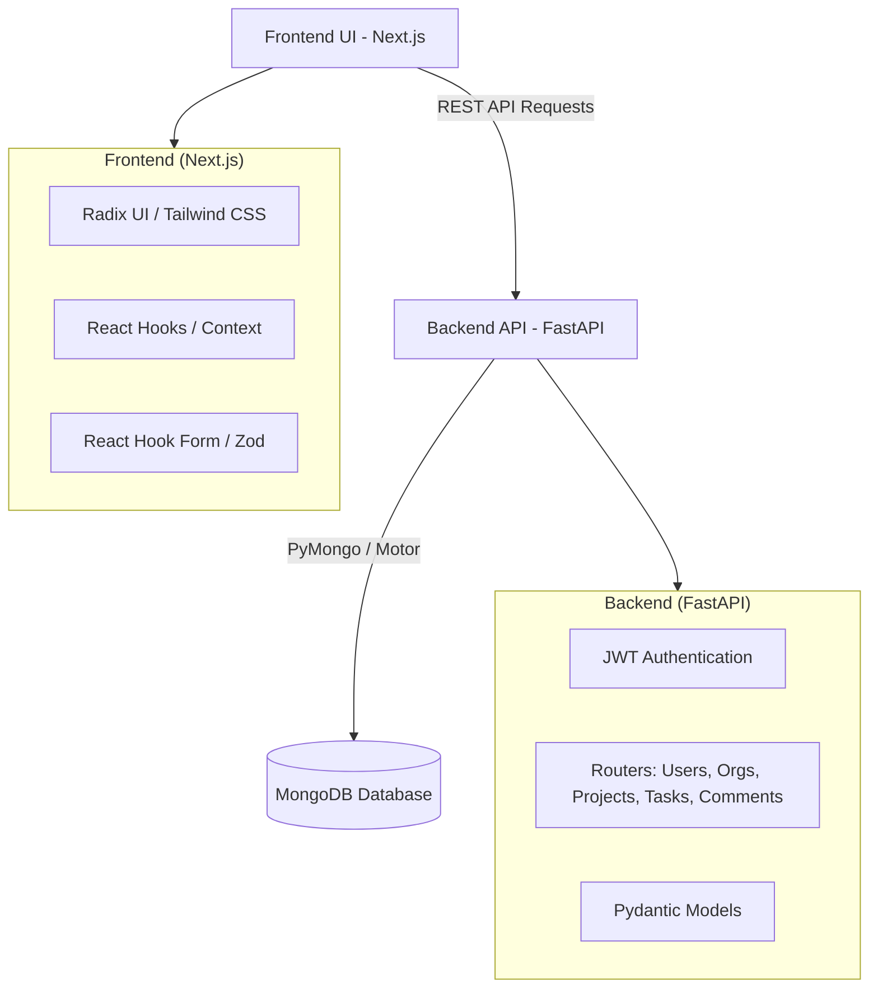

# SynergySphere – Advanced Team Collaboration Platform

## 🎯 Problem Statement
In modern workplaces, teams struggle with scattered information, unclear progress tracking, and fragmented communication. Important files and decisions are lost in various chat apps and emails. Without a centralized hub, project visibility is poor, leading to missed deadlines, resource overload, and lack of alignment among team members. Existing tools are often too rigid or only solve part of the problem.

## 💡 Solution
**SynergySphere** is an intelligent team collaboration platform built to unify project management, task tracking, and team communication into a single, intuitive interface. It acts as the backbone for modern teams, replacing scattered workflows with a centralized, responsive system that helps teams stay organized, communicate seamlessly, and manage resources efficiently.

## 🏗️ Architecture



## ✨ Key Features
* **User Authentication & Management:** Secure registration and login using JWT tokens and password hashing (bcrypt). Search for users to invite them to projects.
* **Organization Management:** Create dedicated organizations/workspaces and allow users to seamlessly join them.
* **Project Management:** Create and manage projects with custom priorities, descriptions, deadlines, and tags. Assign roles (manager, contributor, viewer) to team members.
* **Task Tracking:** Create, assign, and update tasks with statuses (pending, in-progress, completed). Track task progress visually.
* **Team Communication:** Contextual commenting system built directly into tasks, ensuring discussions remain tied to actionable items.
* **Real-time Notifications:** In-app notification system alerts users when they are assigned a task or when project updates occur.
* **Modern UI/UX:** Responsive, accessible, and highly interactive interface built with Next.js, Tailwind CSS, and Radix UI components.

## 📂 Folder Structure

```text
SynergySphere/
├── backend/                  # FastAPI Backend
│   ├── .env                  # Backend environment variables (ignored in version control)
│   ├── init_db.py            # MongoDB database initialization & schema validation
│   ├── main.py               # Main FastAPI application and API routes
│   └── __pycache__/
├── frontend/                 # Next.js Frontend
│   ├── app/                  # Next.js App Router pages and layouts
│   ├── components/           # Reusable Radix UI & custom React components
│   ├── contexts/             # React context providers for global state
│   ├── hooks/                # Custom React hooks
│   ├── lib/                  # Utility functions and API client
│   ├── public/               # Static assets
│   ├── styles/               # Global CSS and Tailwind configurations
│   ├── package.json          # Frontend dependencies and scripts
│   ├── tailwind.config.js    # Tailwind CSS styling configuration
│   └── tsconfig.json         # TypeScript configuration
└── README.md                 # Project documentation
```

## 🛠️ Technology Stack
* **Frontend:** Next.js, React, Tailwind CSS, Radix UI, TypeScript, React Hook Form, Zod.
* **Backend:** Python, FastAPI, Pydantic, Passlib, JWT (jose).
* **Database:** MongoDB (Motor async driver & PyMongo).
